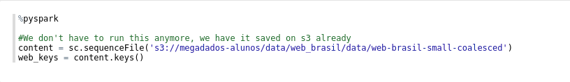

# <i>Finder de receitas da Vovó</i>
Projeto final da disciplina de Megadados - Insper 6º Semestre

<strong> Por Alexande Young, Jean Luca e Pedro de la Peña </strong>

### Introdução

Todas as interações realizadas na rede geram informações que são trasnmitidas e armazenadas em diversos pontos da Internet. Alguns sites como o [Common Crawl](http://commoncrawl.org/) coletam informações públicas de páginas da web ao longo de um determinado período de tempo (na maioria dos casos isto ocorre mensalmente) e depois disponibilizam estas informações para download em seu site, para que qualquer um que esteja interessado possa realizar análises sobre os dados e encontrar soluções inteligentes para algum problema. Contudo, caso um usuário queira iterar sobre todos os dados, por mais poderosa que sua máquina seja, ele não conseguirá faze-lo localmente, pois os dados podem possuir mais de um petabyte de informação. Desta forma, para realizar análises e evitar a sobrecarga de uma máquina, é preciso utilizar várias máquinas operando em paralelo sobre os dados, fazendo com que a análise seja possível e relativamente mais rápida dependendo do número de máquinas utilizadas, suas configurações e o tamanho dos dados a serem analisados.

Para este e outros fins, existem sites que fornecem serviços de <i>public cloud</i>, onde um usuário pode executar máquinas virtuais dos mais diversos tipos e configurações em <i>clusters</i>, como é o caso da [Amazon](https://aws.amazon.com/).

### O projeto

O grupo pensou em ajudar suas vós, que não estão muito acostumadas com o ambiente da internet porém que adoram fazer receitas deliciosas durante o ano todo (com excessão do Natal quando resolvem colocar uva-passa em tudo). Sendo assim, desejou-se calcular quantos sites de receita existem na web Brasil (site pt-br) para que nossas vovós sempre tenham receitas gostosas para fazer. 

Inicialmente, foi carregado um fragmento do Crawl da Web Brasil (disponibilizado pelo professor) no Spark, que estava sendo rodado em uma máquina m4.xlarge como master e uma m4.large como worker.

Com o intuito de classificar sites automaticamente como "site de receita" e "outros", o grupo selecionou 100 amostras aleatórias do fragmento, porém que continham a palavra "receita" em algum ponto do site. A partir desses dados, o grupo analisou manualmente cada um desses 100 sites localmente em um [Jupyter Notebook](/manualfilter.ipynb), para confirmar quantos realmente eram de receita e quantos eram <i>falsos positivos</i>. A partir dessa análise, foram contados 53 sites de receita para 47 falsos positivos e uma máscara de bits foi gerada com base nessas informações.

A partir da máscara de bits, foi treinada uma inteligencia artificial básica (classificador de Naive-Bayes) que decide se um site é de receitas ou não com base em seu conteúdo. Foram ignoradas palavras grandes (com mais de 15 caracteres) e também muito pequenas (1 ou 2 caracteres) para não considerar palavras de conexão (e, a, um, ou, de). As primeiras 100 palavras do site foram consideradas para a análise, pois se o site é realmente de receitas, palavras chave relacionadas ao assunto estarão dispostas logo no começo da página. O algoritmo funciona percorrendo o site e adicionando um contador às palavras. A partir da máscara, é possivel "guiar" a inteligência, ensinando-a o que realmente é um site de receita e o que não é, com base em palavras chave dos mesmos. 

Após treinada, a inteligencia artificial percorreu 10 mil amostras aleatórias e classificou 87 delas como supostos sites de receita. O algorítmo de classificação realiza uma conta de probabilidade para cada palavra de cada site, multiplicando o valor do contador dependendo do resultado das ocorrencias da palavra (relacionadas a receita ou não). Caso o contador fosse maior para um site de receitas, a palavra tem bastante chance de fazer parte de um site deste tipo.  Contudo, em alguns casos existem algumas "aberrações" como sites com caracteres não antes utilizados nos demais, e desta forma, segundo as condições de análise e julgamento da inteligência artificial, o valor de relevancia (de que o site de fato era um site de receitas).  

### Conclusão

Com exceção de algumas aberrações, o algorítmo consegue realizar a filtragem de grandes bancos de dados com base em uma estimativa das palavras mais frequentes utilizadas em um determinado contexto. Contudo, ainda existem alguns sites que são dados como receitas porém, na realidade, não são (exemplo: site de atacadista que possui diversos ingredientes à venda). 

### O que deu errado

Visto que o algoritmo percorre cada site e depois disso cada palavra de cada site (até um limite definido pelo usuário, no nosso caso 100), ele demora MUITO para ser executado. Desta forma, a filtragem de 10000 sites levou por volta de 4 horas e meia e considerando o atraso, não foi possível executar o código novamente em uma base de dados ainda maior. 

### Diferentes usos e futuras implementações

O algorítmo pode ser facilmente modificado para treinar uma inteligência artificial para buscar por qualquer coisa, mesmo que o número de amostras para o treinamento seja baixa, no nosso caso 100 (um número alto é preferível, já que desta forma a inteligência artificial tem mais dados para levar em consideração, o que pode eliminar algumas "aberrações" e falsos-positivos).

